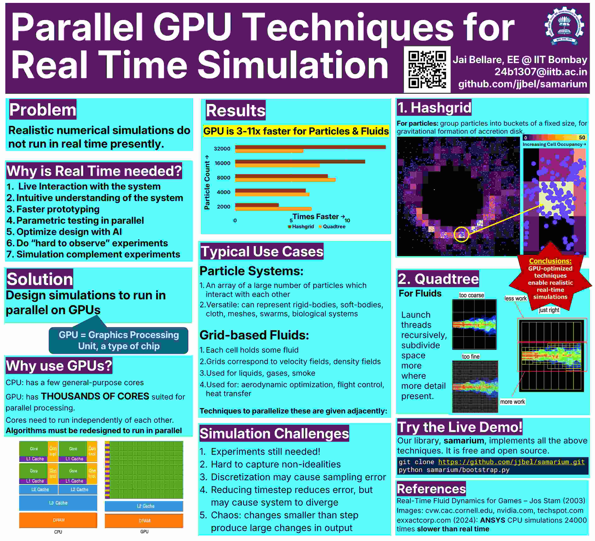

Real Time Simulation - Poster
==============================

* Poster presentation on using GPUs for real time

`Download PDF <https://drive.google.com/file/d/1OC7ySoN1FaaiXtPyvp79Pdb_BZyvw8F4/view?usp=sharing>`_

GET THE CODE HERE: https://github.com/jjbel/samarium
specifically, see the gravity hashgrid example:
Run the program: `build\examples\Release\gravity.exe`

Problem
------------------------
Realistic numerical simulations do not run in real time presently.
Simulation is computationally intensive. There is a trade-off between the required accuracy, domain size, time interval, and the time required for the simulation itself. It is greatly benefical for the user if the simulation runs in real time, ie the time interval in the system equals the time required for simulation. 

Why is Real Time needed?
------------------------
1. The user can interact with the system, giving inputs dynamically, rather than having to preprogram it.
2. The user can get an intuitive understanding of the system's behaviour, for example over large time scales, where a short duration simulation doesn't capture the entire behaviour.
3. Faster prototyping: if designing a part, the user can run multiple simulations in parallel and find an optimum design, possibly with AI. For example, when designing the shape of a vehicle body to minimize its drag coefficient, gradient descent can be used.
4. Do “hard to observe” experiments: For example, when studying the relativistic hydrodynamics of neutron stars, the phenomenon is hard to observe in detail, since the frequency of occurence is low, but it is easy to simulate. Simulation complement experiments: simulation accuracy can be verified based on existing empirical data, and new observational instruments can be designed to look for phenomena predicted by simulation.

Why GPUs are a Solution
------------------------
The CPU (central processing unit) is the primary computing device. It consists of 2 to 12 cores, where each core runs a given task concurrently with the other cores. Multiple cores allows running different programs, or multiple instances of the same program.
CPU cores are general purpose: they are meant for math calculation, as well as working with files, network etc

Hashgrids
---------

To find the forces of gravity among n particles, we would have to go through :math:`n^2` pairs of particles. For 1000 particles, this is 1 million checks, which is very slow.
Since gravity falls off as :math:`\frac{1}{r^2}`, we make the following approximation:
Ignore gravity between particles further than :math:`d` distance away. Smaller :math:`d` results in faster but less accurate simulation.
Then, we split space into a grid of squares of side :math:`s` where :math:`s` is proportional to :math:`d`.
We make a list of which particles are in which square. Then we only check for gravity between particles in neighbouring squares. Specifically for a given particle P, check for gravity in the particles 3x3 block centered at P's square.
